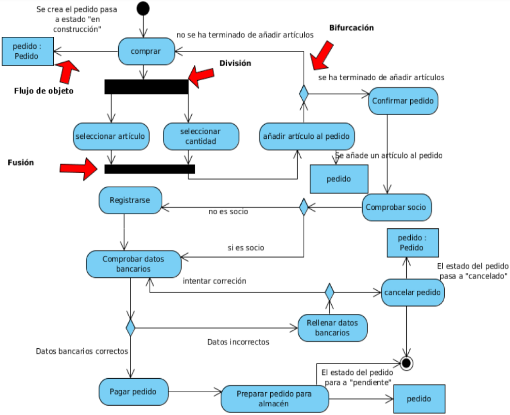

<h1>EXPLICACIÓN DIAGRAMA DE ACTIVIDAD</h1>

El diagrama empieza con la compra de un producto. Dicha compra genera un pedido de forma automática.

Después de esto, se seleccionan el artículo a comprar y la cantidad que se quiere comprar, estos dos elementos de forma separada. Los dos elementos se fusionan para seguir con el diagrama.

Una vez seleccionados, se añade el artículo al pedido que se creó al comienzo. En este punto existen dos opciones:

<li>No se ha terminado de añadir artículos, por lo que se vuelve al comienzo del diagrama para seleccionar de nuevo un artículo y su cantidad.</li>

<li>Se ha terminado de añadir artículos, por lo que pasa a confirmarse el pedido.</li>

Mientras se confirma el pedido, se comprueba el socio que realiza el pedido.

Según se puede ver el este diagrama, es necesario estar registrado para poder realizar un pedido, por lo que después de comprobar el socio existen dos opciones de continuar:

<li></li>