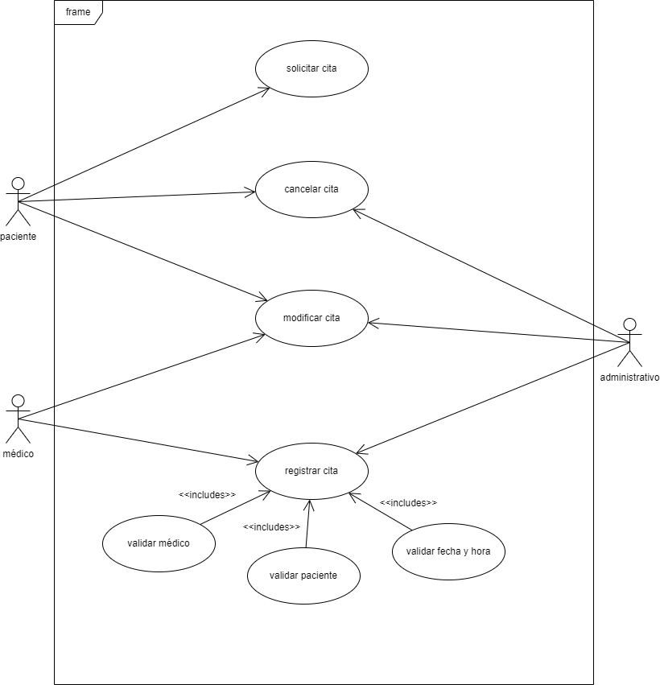

<h1>ACTIVIDAD DÍA 20/02/2023</h1>

<b>1. Modifica el siguiente caso de uso de la gestión de una cita del SAS:</b>

Respuesta:

<b>2. Explica el siguiente diagrama de secuencia. ¿Lo consideras válido? ¿Lo modificarías de alguna forma?</b>

Este diagrama representa el proceso que se realiza para que un paciente pueda pedir una cita médica.

Para empezar, el paciente realiza la solicitud, que se envía al sistema del centro médico. Comienza el proceso de validación del paciente: si el paciente es validado correctamente, se pasa a la siguiente fase; sino, se vuelve un paso atrás y el paciente deberá realizar la solicitud de nuevo (preferiblemente después de arreglar los problemas con su validación).

La siguiente fase es la validación del médico, seguida de la validación de la fecha y hora de la cita, las cuales siguen el mismo proceso que la verificación del paciente: comprobar que no hay ningún error con ninguna de las entidades o elementos para que la cita se pueda registrar sin ningún inconveniente.

Una vez se ha realizado la validación completa, la cita se añade/registra en el sistema y esta lista para ser realizada en la fecha y hora y con el médico y el paciente correspondiente.

<b>3. Dibuja un diagrama de secuencia que nos explique el funcionamiento que tiene un usuario de un metro en cuanto a la venta de tickets de metro. Deberá existir un actor y dos objetos llamados "venta de tickets" y "tickets".</b>

