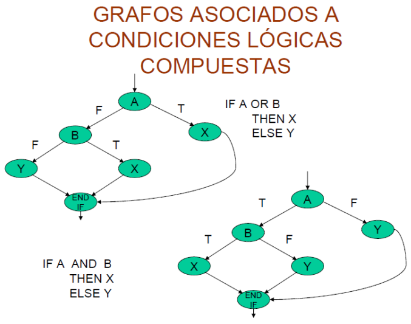

<style>
  h1, h2, h3, h4, h5, h6{
    text-align: center;
    font-weight: bold;
    border: none;
    margin-bottom: 0px;
  }

  p{
    text-align: justify;
  }

  img{
    border: 2px solid black;
  }
</style>

<h1>CAJA BLANCA</h1>

<h4>CHRISTIAN MILLÁN SORIA</h4>

<h4>1º DAW TARDE</h4>

<hr>

<p><b>1. Si tenemos el siguiente algoritmo, que averigua si un número es primo o no:</b></p>

```
algoritmo primos
  escribir "Numero: "
  leer num

  cont<-2;
  swPrimo<-'V'

  mientras((cont<=(num/2))y(swPrimo=='V'))hacer
    si((num mod cont)==0)entonces
      swPrimo<-F
    fin si

    cont<-cont+1
  fin mientras

  si(swPrimo=='V')entonces
    escribir num, " SI es primo"
  sino
    escribir num, " NO es primo"
  fin si
fin algoritmo
```

<p><b>Indica varios casos de prueba posibles, así como algún procedimiento de prueba.</b></p>

<p>Algunos casos de prueba posibles podrían ser, por ejemplo:</p>

<li>Caso de prueba válido: Ingresar el número 2, que es el número primo más pequeño.</li>

<li>Caso de prueba válido: Ingresar el número 7, que es un número primo.</li>

<li>Caso de prueba inválido: Ingresar el número 10, que no es un número primo.</li>

<li>Caso de prueba válido: Ingresar el número 23, que es un número primo.</li>

<li>Caso de prueba válido: Ingresar el número 29, que es un número primo.</li>

<p>Un posible procedimiento de prueba para verificar que el argoritmo funciona correctamente sería el siguiente (por pasos):</p>

<li>Paso 1: Ingresar un número primo como entrada, por ejemplo, 7.</li>

<li>Paso 2: Ejecutar el algoritmo.</li>

<li>Paso 3: Verificar que el algoritmo indique que el número ingresado es un número primo.</li>

<li>Paso 4: Repetir los pasos 1 a 3 con otros números primos para asegurarse de que el algoritmo los identifique correctamente.</li>

<li>Paso 5: Ingresar un número que no sea primo, por ejemplo, 10.</li>

<li>Paso 6: Ejecutar el algoritmo.</li>

<li>Paso 7: Verificar que el algoritmo indique que el número ingresado no es un número primo.</li>

<li>Paso 8: Repetir los pasos 5 a 7 con otros números que no sean primos para asegurarse de que el algoritmo los identifique correctamente.</li>

<li>Paso 9: Asegurarse de que el algoritmo no tenga errores de lógica para cualquier número de entrada mediante el análisis del código fuente y la verificación de los cálculos realizados en el código.</li>

<p><b>2. ¿Qué diferencia existe entre las pruebas de caja blanca y las de caja negra? En el ejemplo anterior, ¿en qué consistirían?</b></p>

<p>Las pruebas de caja blanca y las de caja negra son dos enfoques diferentes para realizar pruebas de software.</p>

<p>Las pruebas de caja negra se basan en probar el software desde el punto de vista del usuario final, sin conocer los detalles internos de cómo se implementa el software. En este enfoque, el software se trata como una "caja negra" y se prueban sus entradas y salidas sin considerar su funcionamiento interno. Las pruebas de caja negra se centran en evaluar si el software cumple con los requisitos funcionales y no funcionales, y si el software es fácil de usar y comprender.</p>

<p>Por otro lado, las pruebas de caja blanca se enfocan en evaluar el software desde su funcionamiento interno y se basan en el conocimiento detallado de la implementación del software. En este enfoque, el tester conoce la estructura interna del código fuente y de la aplicación, y se asegura de que el software se ejecute según lo previsto. Las pruebas de caja blanca se centran en la cobertura de código, en la verificación de la lógica interna del software, y en la identificación de posibles problemas de rendimiento y seguridad.</p>

<p>En el ejemplo anterior, las pruebas de caja blanca implicarían examinar el código fuente del algoritmo para diseñar casos de prueba que cubran todas las posibles rutas de ejecución, lo que se puede lograr mediante pruebas de cobertura de código para asegurarse de que todas las declaraciones y ramas de código se hayan ejecutado al menos una vez. Por otro lado, las pruebas de caja negra implicarían proporcionar diferentes entradas al algoritmo y verificar si las salidas corresponden a las salidas esperadas.</p>

<p><b>3. ¿En qué consiste la cobertura o cubrimiento? Busca en el ejemplo 1 los diferentes tipos de coberturas que existen, si no encuentras ninguno, plantea un ejemplo adicional.</b></p>

<p>La cobertura o cubrimiento es una medida que se utiliza para evaluar la calidad de las pruebas realizadas en un programa. Consiste en medir qué porcentaje del código ha sido ejecutado durante la realización de las pruebas.</p>

<p>En el ejemplo 1, se podrían aplicar diferentes tipos de coberturas, por ejemplo:</p>

<li>Cobertura de sentencias: en este caso, se evalúa si se han ejecutado todas las sentencias del código. En el ejemplo, se debería verificar que se han ejecutado todas las sentencias dentro del bucle mientras, así como las sentencias condicionales dentro del mismo.</li>

<li>Cobertura de ramas: este tipo de cobertura evalúa si se han evaluado todas las condiciones posibles de las sentencias condicionales. En el ejemplo, se debería verificar que se han evaluado tanto la rama verdadera como la falsa del condicional dentro del bucle mientras.</li>

<li>Cobertura de condiciones: este tipo de cobertura evalúa si se han evaluado todas las combinaciones posibles de las condiciones en las sentencias condicionales. En el ejemplo, se debería verificar que se han evaluado tanto la condición num mod cont==0 como su negación.</li>

<p>La elección de qué tipo de cobertura aplicar dependerá del objetivo de las pruebas y del código que se esté evaluando. Por ejemplo, si se quiere evaluar la robustez del código, es posible que sea más relevante aplicar una cobertura de condiciones.</p>

<p><b>5. Utilizando la técnica de caja blanca del "Camino básico", obtén el grafo, el número d complejidad ciclomática y los casos de prueba del siguiente agoritmo:</b></p>

```java
public static int contarLetras(char cadena[], char caracter){
  int contador=0, n=0, lon=cadena.length;

  if(lon>0){
    do{
      if(cadena[contador]==caracter){
        n++;
      }

      contador++;
      lon--;
    }while(lon>0);
  }

  return n;
}
```

<p>Grafo:</p>

<p>Casos de prueba posibles:</p>

<li>Caso de prueba 1: cadena vacía, caracter no importa. En este caso, se espera que la función devuelva 0.</li>

<li>Caso de prueba 2: cadena con un solo carácter que no coincide con el caracter buscado. En este caso, se espera que la función devuelva 0.</li>

<li>Caso de prueba 3: cadena con un solo carácter que coincide con el caracter buscado. En este caso, se espera que la función devuelva 1.</li>

<li>Caso de prueba 4: cadena con varios caracteres, pero ninguno coincide con el caracter buscado. En este caso, se espera que la función devuelva 0.</li>

<li>Caso de prueba 5: cadena con varios caracteres, algunos de los cuales coinciden con el caracter buscado. En este caso, se espera que la función devuelva el número de caracteres que coinciden con el caracter buscado.</li>

<p><b>6. Cuando tenemos condiciones lógicas compuestas se nos complica un poco más la forma de obtener el grafo. El siguiente esquema lo resume de forma bastante clara:</b></p>



<p><b>Utilizando la técnica del "Camino básico", intenta obtener el grafo, el número de complejidad ciclomática y los casos de prueba del siguiente algoritmo que calcula la media aritmética de 2 números:</b></p>

```java
public static void mediaDosNumeros(int x, int y){
  float media=0;

  if((x<0)||(y<0)){
    System.out.print("'x' e 'y' deben ser positivos.");
  }else{
    media=(x+y)/2.0f;

    System.out.print("La media es:"+media+".");
  }
}
```

<p></p>